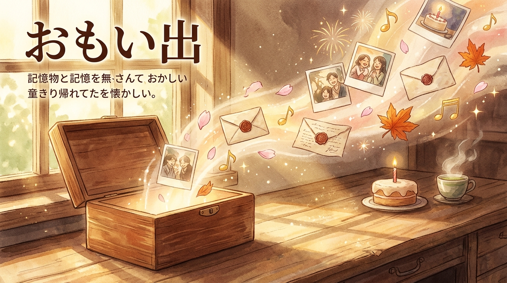

# Omoide

> **Omoide Bako**
> An interactive celebration and keepsake space for birthdays, cherished memories, and friends.

<p align="center">
  
</p>

<p align="center">
  <a href="README.md"></a>
  
  <a href="LICENSE"></a>
  
  
  
  
  
  
  
</p>

## INDEX

1. [ABOUT](#about)
2. [FEATURES](#features)
3. [VALUE](#value)
4. [TECH STACK](#tech-stack)
5. [ENVIRONMENT](#environment)
6. [HOW TO USE](#how-to-use)
7. [DEPLOY](#deploy)
8. [SECURITY](#security)
9. [PROJECT STRUCTURE](#project-structure)
10. [NPM SCRIPTS](#npm-scripts)
11. [DOCUMENTS](#documents)
12. [CONTRIBUTING](#contributing)
13. [LICENSE](#license)

## ABOUT

`Omoide` (Slogan: **Omoide Bako**) is an interactive Web application for remembering, celebrating, documenting, and sharing birthdays and anniversaries.

<p align="center">
  
</p>

Beyond birthday countdowns and 2D/3D cake candle-blowing, it brings together a Three.js interactive 3D Omikuji fortune cylinder, photo & video albums, real-time group chat, a message bulletin board, photo booth, digital time capsule, mini-games, and 13 dynamic seasonal & festival themes into a single warm and inviting space. It is designed to serve as a shared celebration sanctuary for families, friends, teams, or communities.

> [!NOTE]
> This README avoids decorative emoji and represents feature groups with `lucide-react` icon names.

## FEATURES

### CELEBRATION & CORE

| Icon | Feature | Description |
|------|---------|-------------|
| `Timer` | Real-time countdown | Shows the remaining time until the next birthday or milestone using Supabase data. |
| `Cake` | Interactive cake | 2D/3D cake with microphone-enabled candle blowing interaction. |
| `Scroll` | 3D Omikuji Fortune (Three.js) | Interactive 3D Japanese Omikuji cylinder with 360-degree orbit, haptic shake physics, bamboo stick reveal, Waka/Haiku poems, 4 life categories (Bond, Health, Wish, Blessing), and lucky items. |
| `Music` | Music player | Plays celebration songs and nostalgic/vintage tracks with Howler.js. |
| `PartyPopper` | Visual effects | Displays confetti, fireworks, balloons, and seasonal particle effects. |

### MEDIA & KEEPSAKES

| Icon | Feature | Description |
|------|---------|-------------|
| `Image` | Photo & video album | Organizes memories with Supabase Storage. |
| `Camera` | Photo booth / frame | Takes photos via WebRTC camera and frames them with custom seasonal borders. |
| `Clock` | On This Day Flashback | Revisit memories and photos from past milestones on the same calendar day. |
| `Mail` | Time Capsule | Seal letters, photos, and audio recordings to be unlocked on future milestone dates. |
| `Tags` | Tag management | Adds searchable tags to media files. |
| `Upload` | Media upload | Supports image and video uploads through `react-dropzone`. |
| `Search` | Search | Helps users find media by tags or text. |

### GAMES AND ENTERTAINMENT

| Icon | Feature | Description |
|------|---------|-------------|
| `Brain` | Memory game | Card matching mini-game for entertainment. |
| `Puzzle` | Jigsaw puzzle | Creates customizable jigsaw puzzles from memory photos. |
| `HelpCircle` | Birthday quiz | Interactive trivia quiz for the celebrant. |
| `Calendar` | Birthday calendar | Monthly overview of birthdays and anniversaries. |

### COMMUNITY

| Icon | Feature | Description |
|------|---------|-------------|
| `MessageCircle` | Real-time chat | Real-time group messaging powered by Supabase Realtime. |
| `ClipboardList` | Message board (Yosegaki) | Digital guestbook for wishes, likes, and replies. |
| `Mic` | Voice messages | Browser voice recording and audio message sharing. |
| `Video` | Video messages | Record and save video greetings directly from the webcam. |
| `Gift` | Virtual gifts | Select and send digital celebration gifts. |
| `Share2` | Sharing links | Share invite links directly to social platforms. |

### THEMES & MOBILE OPTIMIZATION

| Icon | Feature | Description |
|------|---------|-------------|
| `Palette` | Four seasons | Dynamic visual themes for Spring, Summer, Autumn, and Winter. |
| `CalendarDays` | 13 Festival themes | Dynamic themes for Hanami, Tanabata, Obon, Tsukimi, Shogatsu, Halloween, Christmas, etc. |
| `Compass` | Mobile Bottom Dock & Drawer | Mobile-first bottom dock and expandable Japanese memory drawer. |
| `Type` | Japanese Typography System | High-contrast font stack: Windows (Yu Gothic / Meiryo), macOS / iOS (Hiragino Sans), and Mincho Serif (Yu Mincho / Noto Serif JP). |
| `Languages` | Multi-language (i18n) | Seamless switching between Japanese (JA) and English (EN). |

## VALUE

1. **Never miss a milestone**
   - Live countdowns to upcoming birthdays and special dates.
   - Centralized anniversary registry for friends and family.

2. **A digital keepsake box (Omoide Bako)**
   - Consolidate photos, videos, voice recordings, guestbook wishes, photobooth strips, and time capsules in one place.
   - Relive cherished moments anytime in a nostalgic, cozy atmosphere.

3. **Joyful online celebrations**
   - Interactive 3D Omikuji, mini-games, and animated effects bring energy and delight.
   - Dynamic 13-festival theme engine keeps the site fresh and lively all year round.

4. **Private community sanctuary**
   - Ideal for friend circles, school clubs, teams, and families.
   - Open source and highly extensible for your own events.

## TECH STACK

### FRONTEND

| Technology | Version | Purpose |
|------------|---------|---------|
| Next.js | 16.0.7 | App Router & API Routes (Turbopack) |
| React | 19.2.1 | UI Components |
| Three.js | 0.185.1 | 3D Omikuji cylinder & WebGL rendering |
| TypeScript | 5.x | Type safety |
| Tailwind CSS | 4.x | Styling |
| Framer Motion | 12.23.25 | Animation |
| lucide-react | 0.556.0 | UI Icons |
| Zustand | 5.0.9 | Global state |
| TanStack Query | 5.90.12 | Server state & caching |
| Howler.js | 2.2.4 | Audio playback |
| react-dropzone | 14.3.8 | Drag-and-drop file upload |
| date-fns | 4.1.0 | Date utilities |

### BACKEND & SERVICES

| Technology | Purpose |
|------------|---------|
| Supabase | PostgreSQL-based BaaS |
| Supabase Storage | Media asset storage |
| Supabase Realtime | Real-time messaging subscription |
| Next.js API Routes | Serverless backend endpoints |
| Vercel Analytics | Web analytics |
| Vercel | Hosting platform |

## HOW TO USE

```bash
# 1. Clone repository
git clone https://github.com/hayato-shino05/happy-birthday-website.git
cd happy-birthday-website

# 2. Install dependencies
npm install

# 3. Configure environment
cp .env.example .env.local

# 4. Start development server
npm run dev
```

## AUTHOR

- GitHub: [@hayato-shino05](https://github.com/hayato-shino05)

## LICENSE

This project is licensed under the [MIT License](./LICENSE).

<p align="center">
  <strong>Crafted for cherishing memories and sharing joy with loved ones.</strong>
</p>
